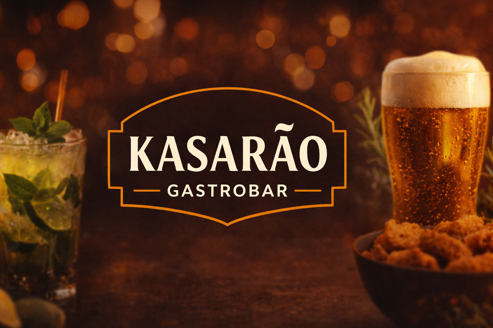
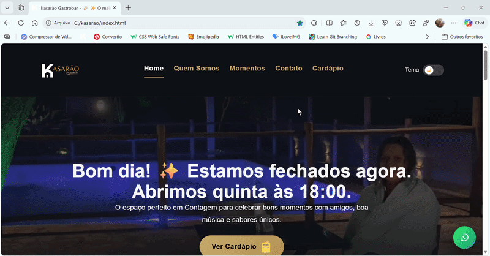

# 🍻 Kasarão Gastrobar — Website Oficial

## 🖥️ Preview do site

## 📂 Estrutura do projeto

kasarao
│
├── css
│   ├── global.css
│   ├── menu.css
│   ├── index.css
│   ├── momentos.css
│   ├── contato.css
│   ├── cardapio.css
│   └── quem-somos.css
│
├── js
│   └── script.js
│
├── img
│   └── imagens do site
│
├── video
│   └── vídeos utilizados no carrossel
│
├── index.html
├── momentos.html
├── quem-somos.html
├── contato.html
├── cardapio.html
│
└── README.md

## ⚙️ Tecnologias

- HTML5
- CSS3
- JavaScript
- Layout Responsivo
- SEO básico

## 🚀 Como executar o projeto

Clone o repositório

git clone https://github.com/luizgteixeira/kasarao.git

Entre na pasta

cd kasarao

Abra o arquivo

index.html

## 👨‍💻 Desenvolvedor

**Luiz Gustavo**  
Front-End Developer

GitHub  
https://github.com/luizgteixeira
