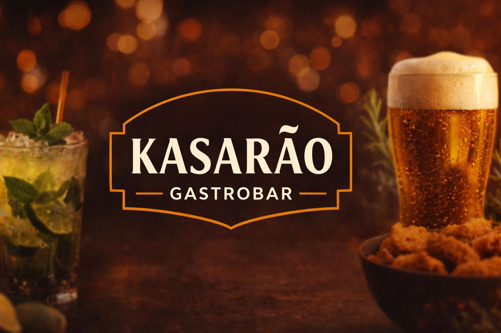
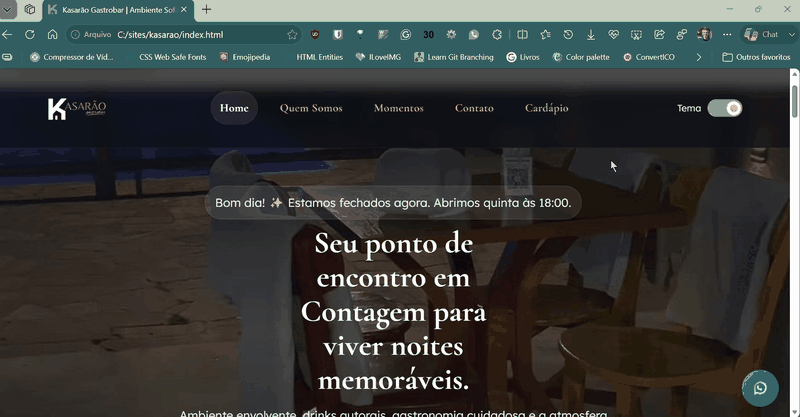

<p align="center">
  
</p>

<h1 align="center">Kasarão Gastrobar</h1>

<p align="center">
  Case de website institucional criado para fortalecer a presença digital do Kasarão Gastrobar, transmitir a atmosfera da marca com mais sofisticação e aumentar o potencial de reservas, contatos e pedidos.
</p>

<p align="center">
  
  
  
  
  
</p>

<p align="center">
  <a href="https://kasaraogastrobar.com/">Site oficial</a> •
  <a href="https://www.instagram.com/kasaraogastrobar/">Instagram</a> •
  <a href="https://luizgustavodev.com">Portfólio do desenvolvedor</a>
</p>

---

## Preview



## Contexto

O Kasarão Gastrobar precisava de uma presença digital mais alinhada à experiência oferecida pela casa: ambiente marcante, proposta acolhedora, gastronomia de qualidade e atendimento cuidadoso.

Mais do que “estar online”, o objetivo era criar um site capaz de comunicar valor, despertar desejo e conduzir o visitante com clareza até ações concretas, como reservar uma mesa, entrar em contato ou acessar o cardápio.

## Desafio

O principal desafio do projeto foi transformar a essência do ambiente físico em uma experiência digital elegante, direta e convincente.

Os pontos centrais eram:

- transmitir sofisticação sem perder acolhimento
- organizar o conteúdo institucional de forma mais estratégica
- facilitar o caminho até reserva, contato e pedido
- melhorar apresentação da marca em dispositivos móveis
- estruturar uma base técnica mais sólida para SEO local

## Solução

A solução adotada foi o desenvolvimento de um website institucional estático, com foco em performance, clareza de navegação e valorização visual da marca.

O projeto foi estruturado com:

- páginas dedicadas para apresentação, história, galeria, contato e cardápio
- hero com vídeo e CTA principal para reserva
- narrativa institucional mais forte na home e na página `Quem Somos`
- seções de prova social com depoimentos reais
- carrosséis para destacar momentos e avaliações com mais elegância
- navegação responsiva com menu mobile e tema persistente
- atalhos diretos para WhatsApp, mapa, e-mail e sistema de pedidos

## Decisões de produto e UX

Algumas decisões foram tomadas para aumentar percepção de valor e conversão:

- múltiplos CTAs distribuídos ao longo da jornada, sem depender apenas do topo
- uso de vídeos e imagens para aproximar o visitante da atmosfera da casa
- reforço visual dos diferenciais, como ambiente, atendimento e experiência gastronômica
- aplicação de prova social com comentários reais de clientes
- foco em leitura confortável, contraste e navegação intuitiva

## SEO e estrutura técnica

O projeto inclui uma base on-page pensada para melhorar a presença do negócio em buscas:

- `title` e `meta description` personalizados por página
- canonical tags
- Open Graph e Twitter Cards
- `schema.org` em JSON-LD para restaurante
- `robots.txt`
- `sitemap.xml`
- imagens com `alt`
- skip link para acessibilidade
- layout responsivo com foco mobile-first na experiência prática

## Principais recursos

- hero com vídeo de fundo
- CTA para reservas via WhatsApp
- modo claro/escuro com persistência
- menu fixo e navegação mobile
- seção institucional com história, ambiente, missão e proprietários
- carrossel premium de fotos e vídeos
- carrossel de depoimentos reais carregados de `data/testimonials.json`
- administração de depoimentos em `admin-depoimentos.html`
- página de contato com mapa e links rápidos
- integração com cardápio e pedido online
- botão flutuante de WhatsApp

## Estrutura do projeto

```text
kasarao/
├── css/
│   ├── global.css
│   ├── menu.css
│   ├── index.css
│   ├── quem-somos.css
│   ├── momentos.css
│   ├── contato.css
│   ├── cardapio.css
│   └── admin-depoimentos.css
├── data/
│   └── testimonials.json
├── img/
├── js/
│   ├── script.js
│   └── admin-testimonials.js
├── video/
├── tools/
│   └── admin-server.js
├── iniciar-admin-depoimentos.cmd
├── index.html
├── admin-depoimentos.html
├── quem-somos.html
├── momentos.html
├── contato.html
├── cardapio.html
├── robots.txt
├── sitemap.xml
└── README.md
```

## Arquitetura das páginas

- `index.html`: branding, diferenciais, CTA e prova social
- `admin-depoimentos.html`: cadastro, edição, exclusão, ordenação, importação e exportação dos depoimentos
- `quem-somos.html`: narrativa institucional e apresentação da essência da marca
- `momentos.html`: galeria de fotos e vídeos da experiência do ambiente
- `contato.html`: canais de contato, localização e acesso rápido
- `cardapio.html`: apresentação gastronômica e link direto para pedidos

## Atualização de depoimentos

1. Abra `iniciar-admin-depoimentos.cmd`.
2. Adicione, edite, oculte, exclua ou reordene os depoimentos.
3. Use **Pré-visualizar** para conferir o rascunho no carrossel da home.
4. Use **Salvar no site** para gravar direto em `data/testimonials.json`.
5. Use **Baixar cópia de segurança** apenas se precisar publicar manualmente ou guardar uma cópia.

## Tecnologias utilizadas

- HTML5
- CSS3
- JavaScript
- Google Fonts
- JSON-LD com `schema.org`

## Resultados esperados

Com essa estrutura, o site passa a entregar melhor:

- percepção de marca mais forte e profissional
- jornada mais clara para contato e reserva
- melhor leitura da proposta do negócio
- aumento do potencial de conversão em WhatsApp e pedidos
- presença digital mais preparada para SEO local

## Como executar localmente

Este é um projeto estático, sem etapa de build.

1. Clone o repositório:

```bash
git clone https://github.com/luizgteixeira/kasarao.git
```

2. Entre na pasta:

```bash
cd kasarao
```

3. Abra `index.html` no navegador.

Se preferir, utilize uma extensão como Live Server para desenvolvimento local com recarregamento mais prático.

## Autor

Desenvolvido por **Luiz Gustavo**.

- Portfólio: [luizgustavodev.com](https://luizgustavodev.com)
- GitHub: [@luizgteixeira](https://github.com/luizgteixeira)

## Licença

Projeto institucional desenvolvido para o Kasarão Gastrobar.

Caso queira utilizar esta base como referência, o ideal é adaptar textos, identidade visual, imagens e posicionamento antes de publicar.
